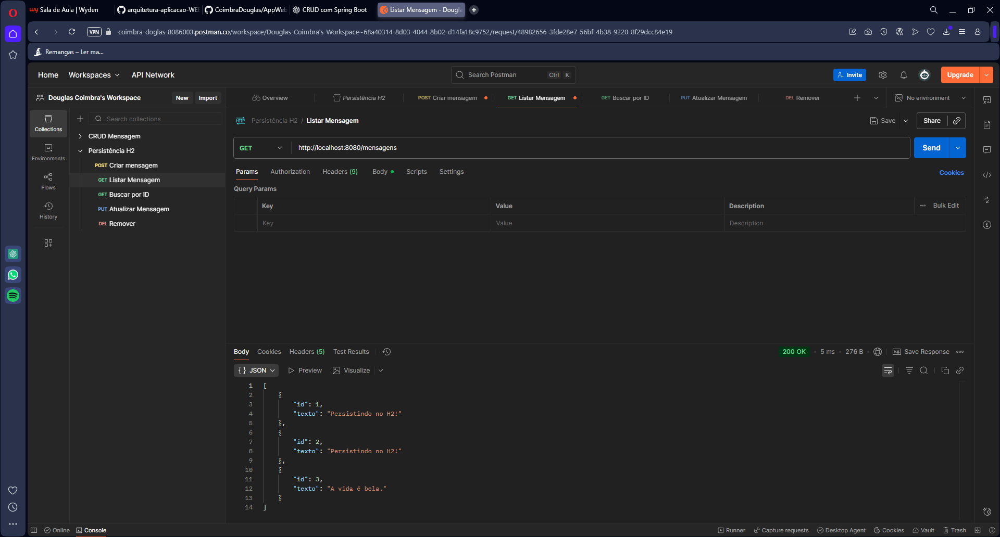

# 📝 Projeto: CRUD com Spring Boot MVC, Lista em Memória e H2 + JPA  

## 📌 Descrição  
Este projeto é um **CRUD de Mensagens** desenvolvido com **Spring Boot**, aplicando o padrão arquitetural **MVC (Model-View-Controller)**.  
Inicialmente, as mensagens são armazenadas em uma lista em memória e, em seguida, os dados passam a ser persistidos em um **banco de dados H2** utilizando **Spring Data JPA**.  

O sistema expõe uma **API REST** com operações de **criação, leitura, atualização e exclusão** de mensagens.  

---

## 🚀 Tecnologias Utilizadas  
- **Java 17+**  
- **Spring Boot 3+**  
- **Spring Web**  
- **Spring DevTools**  
- **Spring Data JPA**  
- **H2 Database**  

---

## ⚙️ Como Rodar o Projeto  

1. Clone o repositório:
   
```
git clone https://github.com/CoimbraDouglas/AppWebCRUD_H2.git
cd AppWebCRUD_H2
```
   
Compile e rode a aplicação:

```
./mvnw spring-boot:run
```
ou

```
mvn spring-boot:run
```

💡 Alternativamente, você pode rodar a aplicação direto pela sua IDE (IntelliJ, Eclipse, VS Code) executando a classe principal marcada com @SpringBootApplication.

Quando o servidor iniciar, acesse no navegador ou Postman:

```
http://localhost:8080
```

---

📡 Endpoints da API
➕ Criar Mensagem

POST /mensagens

```
{
  "texto": "Minha primeira mensagem"
}
```

📋 Listar Todas as Mensagens
GET /mensagens

Resposta (exemplo):

```
[
  {
    "id": 1,
    "texto": "Minha primeira mensagem"
  },
  {
    "id": 2,
    "texto": "Outra mensagem"
  }
]
```

🔍 Buscar Mensagem por ID

```
GET /mensagens/{id}
```

Exemplo:

```
GET /mensagens/1
```

Resposta:

```
{
  "id": 1,
  "texto": "Minha primeira mensagem"
}
```

✏️ Atualizar Mensagem

```
PUT /mensagens/{id}
```

```
{
  "texto": "Mensagem atualizada"
}
```

❌ Deletar Mensagem

```
DELETE /mensagens/{id}
```

---

🗄️ Banco de Dados H2

A aplicação utiliza o banco H2 em memória.
Após rodar a aplicação, você pode acessar o console em:

```
👉 http://localhost:8080/h2-console
```

JDBC URL: jdbc:h2:mem:testdb

User: sa

Password: (vazio, ou mude em application.properties)

---

📸 Exemplo de Execução



---

✅ Testes com Postman/Insomnia

Certifique-se de que a aplicação está rodando

```
mvn spring-boot:run
```

Abra o **Postman**.

Teste os seguintes endpoints na URL base http://localhost:8080/mensagens:

POST /mensagens

GET /mensagens

GET /mensagens/{id}

PUT /mensagens/{id}

DELETE /mensagens/{id}
